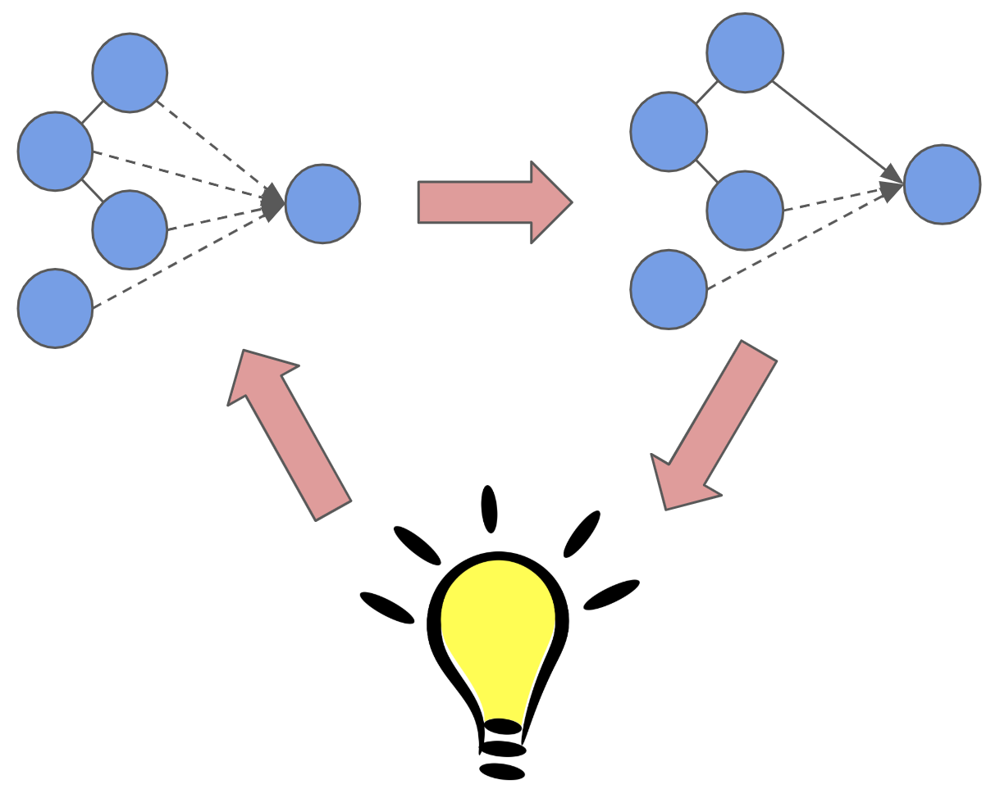

+++
# Project title.
title = "Actionable Bayesian Analysis for Evolving Health Goals"

# Date this page was created.
date = 2019-10-28

# Project summary to display on homepage.
summary = "Many people, especially those with chronic health conditions such as iritable bowel syndrome and chronic migraine, track health related  variables with the hope of discovering connections between causes and symptoms and enabling more informed choices regarding their health. Gaining actionable insights from this kind of data is known to be difficult because current tools often fail to automatically analyze data in scientifically rigorous, helpful, and actionable ways. Additionally, current tools often fail to account for lapses in tracking, evolving health goals, and the growing burden of tracking more information. This tool uses Bayesian network analysis framework to support individuals in analyzing their personal health data in evolving real life contexts."

# Tags: can be used for filtering projects.
# Example: `tags = ["machine-learning", "deep-learning"]`
tags = []

# Optional external URL for project (replaces project detail page).
external_link = ""

# Slides (optional).
#   Associate this project with Markdown slides.
#   Simply enter your slide deck's filename without extension.
#   E.g. `slides = "example-slides"` references 
#   `content/slides/example-slides.md`.
#   Otherwise, set `slides = ""`.
slides = ""

# Links (optional).
url_pdf = ""
url_slides = ""
url_video = ""
url_code = ""

# Custom links (optional).
#   Uncomment line below to enable. For multiple links, use the form `[{...}, {...}, {...}]`.
#links = [{icon_pack = "fab", icon="twitter", name="Follow", url = "https://twitter.com/georgecushen"}]

# Featured image
# To use, add an image named `featured.jpg/png` to your project's folder. 
[image]
  # Caption (optional)
  caption = ""
  
  # Focal point (optional)
  # Options: Smart, Center, TopLeft, Top, TopRight, Left, Right, BottomLeft, Bottom, BottomRight
  focal_point = "Smart"

  preview_only = true
+++
Many people, especially those with chronic health conditions such as iritable bowel syndrome and chronic migraine, track health related  variables with the hope of discovering connections between causes and symptoms and enabling more informed choices regarding their health. Gaining actionable insights from this kind of data is known to be difficult because current tools often fail to automatically analyze data in scientifically rigorous, helpful, and actionable ways. Additionally, current tools often fail to account for lapses in tracking, evolving health goals, and the growing burden of tracking more information. This tool uses Bayesian network analysis framework to support individuals in analyzing their personal health data in evolving real life contexts.
