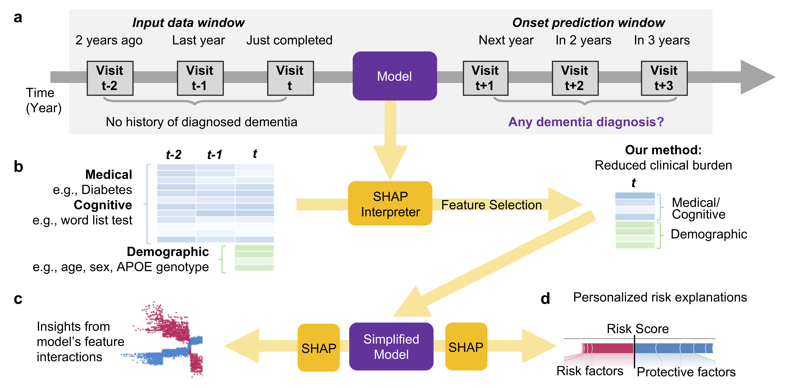

+++
# Project title.
title = "Efficient and Explainable Risk Assessments for Imminent Dementia in an Aging Cohort Study"

# Date this page was created.
date = 2019-10-27

# Project summary to display on homepage.
summary = "As the aging US population grows, scalable approaches are needed to identify individuals at risk for dementia. Common prediction tools have  limited predictive value, involve expensive neuroimaging, or require extensive and repeated cognitive testing.  None of these approaches scale to the sizable aging population who do not receive routine clinical assessments. Our study seeks a tractable and widely administrable set of metrics that can accurately predict imminent (i.e., within three years) dementia onset. To this end, we develop and apply a machine learning (ML) model to an aging cohort study with an extensive set of longitudinal clinical variables to highlight at-risk individuals with better accuracy than standard rudimentary approaches. Next, we reduce the burden needed to achieve accurate risk assessments for those deemed at risk by (1) predicting when consecutive clinical visits may be unnecessary, and (2) selecting a subset of highly predictive cognitive tests. Finally, we demonstrate that our method successfully provides individualized prediction explanations that retain non-linear feature effects present in the data. Our final model, which uses only four cognitive tests (less than 20 minutes to administer) collected in a single visit, affords predictive performance comparable to a standard 100-minute  neuropsychological battery and personalized risk explanations. Our approach shows the potential for an efficient tool for screening and explaining dementia risk in the general aging population."

# Tags: can be used for filtering projects.
# Example: `tags = ["machine-learning", "deep-learning"]`
tags = []

# Optional external URL for project (replaces project detail page).
external_link = ""

# Slides (optional).
#   Associate this project with Markdown slides.
#   Simply enter your slide deck's filename without extension.
#   E.g. `slides = "example-slides"` references 
#   `content/slides/example-slides.md`.
#   Otherwise, set `slides = ""`.
slides = ""

# Links (optional).
url_pdf = "files/dementia_prediction.pdf"
url_slides = ""
url_video = ""
url_code = "https://github.com/suinleelab/EEDRP"

# Custom links (optional).
#   Uncomment line below to enable. For multiple links, use the form `[{...}, {...}, {...}]`.
#links = [{icon_pack = "fab", icon="twitter", name="Follow", url = "https://twitter.com/georgecushen"}]

# Featured image
# To use, add an image named `featured.jpg/png` to your project's folder. 
[image]
  # Caption (optional)
  caption = ""
  
  # Focal point (optional)
  # Options: Smart, Center, TopLeft, Top, TopRight, Left, Right, BottomLeft, Bottom, BottomRight
  focal_point = "Smart"

  preview_only = true
+++
As the aging US population grows, scalable approaches are needed to identify individuals at risk for dementia. Common prediction tools have  limited predictive value, involve expensive neuroimaging, or require extensive and repeated cognitive testing.  None of these approaches scale to the sizable aging population who do not receive routine clinical assessments. Our study seeks a tractable and widely administrable set of metrics that can accurately predict imminent (i.e., within three years) dementia onset. To this end, we develop and apply a machine learning (ML) model to an aging cohort study with an extensive set of longitudinal clinical variables to highlight at-risk individuals with better accuracy than standard rudimentary approaches. Next, we reduce the burden needed to achieve accurate risk assessments for those deemed at risk by (1) predicting when consecutive clinical visits may be unnecessary, and (2) selecting a subset of highly predictive cognitive tests. Finally, we demonstrate that our method successfully provides individualized prediction explanations that retain non-linear feature effects present in the data. Our final model, which uses only four cognitive tests (less than 20 minutes to administer) collected in a single visit, affords predictive performance comparable to a standard 100-minute  neuropsychological battery and personalized risk explanations. Our approach shows the potential for an efficient tool for screening and explaining dementia risk in the general aging population.
