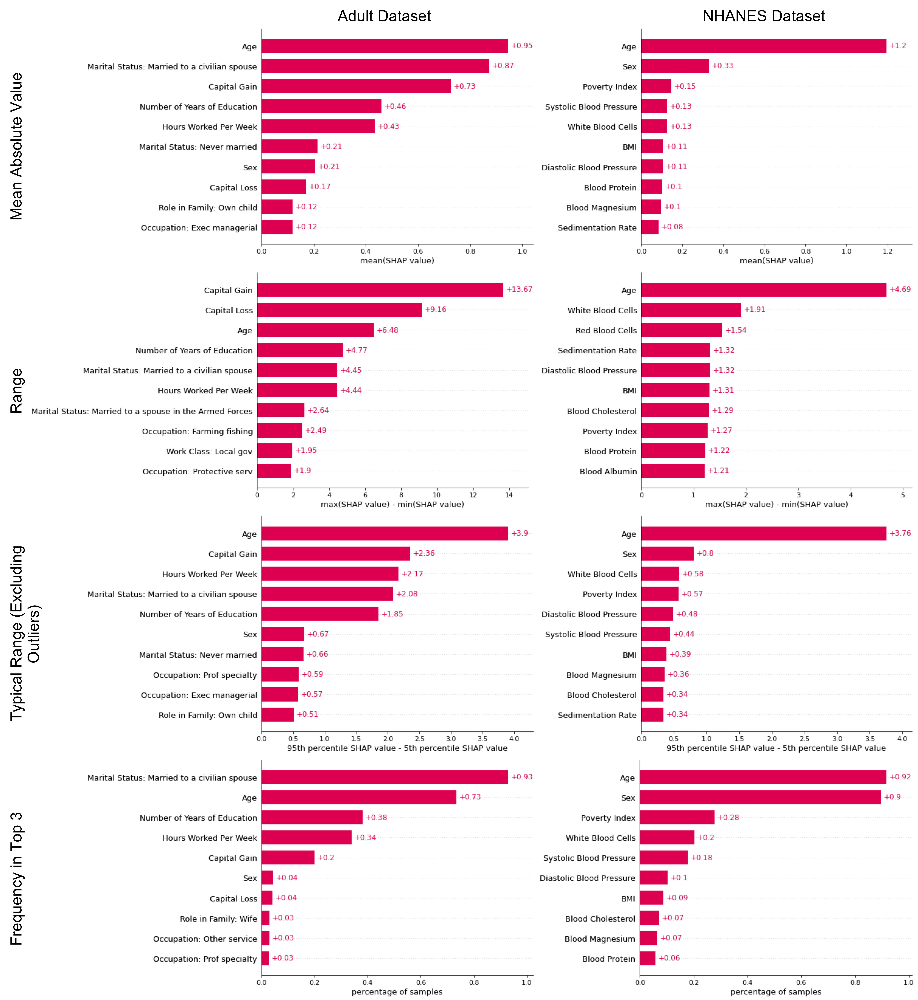

+++
# Project title.
title = "ML Interpretability Tool Use and Global Feature Rankings"

# Date this page was created.
date = 2020-11-10

# Project summary to display on homepage.
summary = "Interpretability tools such as SHAP, LIME, InterpretML, and others are widely used to examine what is happening 'under the hood' of different machine learning algorithms. However, the literature suggests that these tools can be difficult to use and understand, leading to misunderstanding and misplaced trust in a model. I conducted 2 qualitative studies to: 1) understand how experienced users use machine learning interpretability tools and the pitfalls they experience and 2) evaluate an alternative global ranking aggregation scheme. This project was started during an internship with with [Jenn Wortman Vaughan](http://www.jennwv.com/) and [Hanna Wallach](http://dirichlet.net/) in the [FATE group](https://www.microsoft.com/en-us/research/theme/fate/) at Microsoft Research."

# Tags: can be used for filtering projects.
# Example: `tags = ["machine-learning", "deep-learning"]`
tags = []

# Optional external URL for project (replaces project detail page).
external_link = ""

# Slides (optional).
#   Associate this project with Markdown slides.
#   Simply enter your slide deck's filename without extension.
#   E.g. `slides = "example-slides"` references 
#   `content/slides/example-slides.md`.
#   Otherwise, set `slides = ""`.
slides = ""

# Links (optional).
url_pdf = ""
url_slides = ""
url_video = ""
url_code = ""

# Custom links (optional).
#   Uncomment line below to enable. For multiple links, use the form `[{...}, {...}, {...}]`.
#links = [{icon_pack = "fab", icon="twitter", name="Follow", url = "https://twitter.com/georgecushen"}]

# Featured image
# To use, add an image named `featured.jpg/png` to your project's folder. 
[image]
  # Caption (optional)
  caption = ""
  
  # Focal point (optional)
  # Options: Smart, Center, TopLeft, Top, TopRight, Left, Right, BottomLeft, Bottom, BottomRight
  focal_point = "Smart"

  preview_only = true
+++
Interpretability tools such as SHAP, LIME, InterpretML, and others are widely used to examine what is happening 'under the hood' of different machine learning algorithms. However, the literature suggests that these tools can be difficult to use and understand, leading to misunderstanding and misplaced trust in a model. I conducted 2 qualitative studies to: 1) understand how experienced users use machine learning interpretability tools and the pitfalls they experience and 2) evaluate an alternative global ranking aggregation scheme. This project was started during an internship with with [Jenn Wortman Vaughan](http://www.jennwv.com/) and [Hanna Wallach](http://dirichlet.net/) in the [FATE group](https://www.microsoft.com/en-us/research/theme/fate/) at Microsoft Research.
